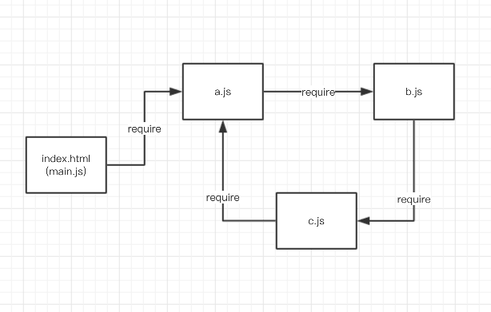

# task模块详细使用

最简单的 `task模块` 写法；

```javascript
task(async(require)=>{
    return "I am task";
});
```

## `task模块`和`define模块`的异同

### 不同

看下面案例：

### define模块

```javascript
// d1.js
// define module test
define(async()=>{
    console.log('I am define module');

    return "d1.js";
});
```

```javascript
// main.js
(async()=>{
    let d1 = await require('d1');

    console.log('first: ' + d1);

    let d1_2 = await require('d1');

    console.log('second: ' + d1_2);
})();
```

控制台结果如下

```
I am define module
first: d1.js
second: d1.js
```

define模块被载入后，里面的函数不会被重新运行；

而task模块如下：

### task模块

```javascript
// t1.js
// task module test
task(async()=>{
    console.log('I am task module');

    return "t1.js";
});
```

```javascript
// main.js
(async()=>{
    let t1 = await require('t1');

    console.log('first: ' + t1);

    let t1_2 = await require('t1');

    console.log('second: ' + t1_2);
})();
```

控制台结果如下

```
I am task module
first: t1.js
I am task module
second: t1.js
```

在被引用时，task模块内的函数会被在运行一次；

task模块文件也只会被载入一次，只是定义的函数会被从新运行；

### 相同

后面讲的很多都是相同点，这里也提一个

### 模块数据


## 模块依赖

task模块也有对其他模块的依赖的时候，函数内第一个参数是 `require`；

```javascript
task(async(require)=>{
    let d1 = await require('js/d1');

    // etc...

    return xxx;
};
```

## 传递数据

`task模块` 和 `define模块` 对比最大的不同点，在于使用 `task模块` 可以传递数据；如下：

```javascript
// t2.js
task(async(require,data)=>{
    let {a,b} = data;

    return a * b;
};
```

```javascript
// main.js
(async()=>{
    let t2 = await require('t2').post({
        a:100,
        b:2
    });

    console.log("100 x 2 = " + t2);
})();
```

控制台结果如下：

```
100 x 2 = 200
```

### task模块常用的一种应用场景

在开发中，模块相当于一个存储数据的容器；使用 task模块，我们可以像使用模块那样，动态获取远程的数据；

```javascript
// t3.js
task(async ()=>{
    let data = await new Promise(res =>{
        $.get("http://xxxx.com/",(data)=>{
            res(data);
        });
    });

    return data;
});
```

```javascript
// main.js
(async()=>{
    let t3 = await require('t3');

    // etc...
})();
```

## 相对路径

跟 `define模块` 一样， `task模块` 也能使用相对路径；

```javascript
require('./t2');

require('../t2');
```

请参考 [define模块相对路径](02.md#相对路径)

## 定义id

跟 `define模块` 一样， `task模块` 也能使用id定义；

```javascript
task(async ()=>{
    // etc...
},'idName')
```

详细参考 [define模块定义id](02.md#定义id)

## 非主流 task模块写法

只要函数返回的是Promise对象，你可以不使用 async function 而用普通函数来写：

```javascript
task(function(){
    return new Promise(res=>{
        xxx
        // etc...
    });
});
```

```javascript
task((require,data)=> new Promise((resolve,reject) => {
    xxx
    // etc...
}));
```

### 注意

模块间的依赖不能形成闭环，闭环依赖会走不出死循环;



上面的 a.js b.js c.js 就是错误示范了；

到这里，你已经能拿起 `drill.js` 进行开发了；

查漏补缺，参考目录

[目录](README.md)