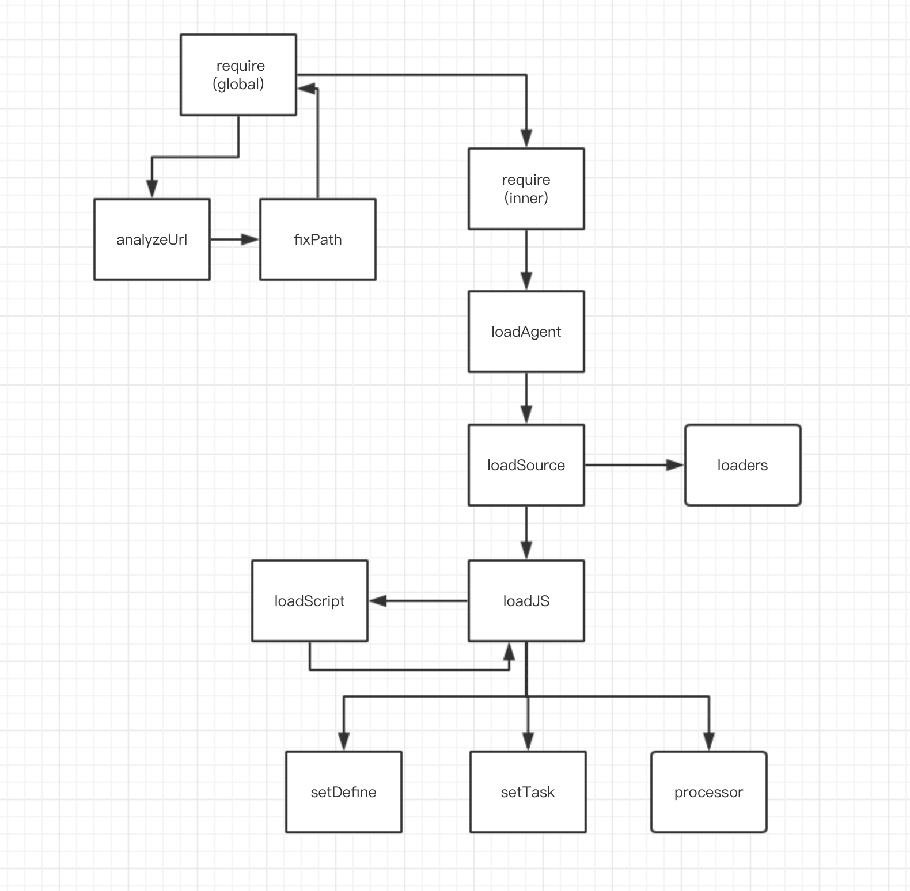

# 如何开发 drill.js 的插件

开发 drill.js 的扩展相对复杂，请先理解完 [drill.js 的基本原理](11.md) 才能继续教程；

`drill.js` 通过 `drill.ext`方法来扩展功能；在图中的任一流程中，进行中间件形式的扩展；



比如像扩展 `loadSource` 的内容，最基础的写法：

```javascript
drill.ext('loadSource', async ([...args], next,{baseResources}) => {
    let [urlObj] = args;

    // etc...

    // 继承返回
    return next(...args);
});
```

第一个参数是当前方法的原来 arguments转换的数组；

第二个参数是中间件的下一个函数，记住，你必须将参数运行回 `next` 函数内，并将结果返回；你可以在这个中间件上修正传入参数，或返回的数据内容，来进行扩展；

第三个参数包含 `baseResources` 的数据对象，以后添加更多数据，就会放在这个对象上；

可以参考文件 `plugin/drill-installer.js`，是一个离线缓存模块的扩展；

## 扩展加载文件类型

通过添加 `loaders` 或 `processor` 来扩展加载文件类型；

### loaders

`drill.js` 默认对 `css` 和 `json` 文件的支持，就是写在 `loaders` 内，一个简单的 `loaders` 扩展如下：

```javascript
drill.loaders.json =  async urlData => {
    // 设置状态
    bag[urlData.path].stat = 3;

    // 请求数据
    let data = await fetch(urlData.link);

    // 转换json格式
    data = await data.json();

    return {
        stat: 1,
        o: {
            async get() {
                return data;
            }
        }
    };
}
```

有点像`define模块`的写法，通过返回 Promise达到挂起状态，在加载完成后，返回一个对象，结构和说明如下：

```javascript
{
    // 1代表载入成功，最后会被覆盖到 bag[urlData.path].stat 上
    stat: 1,
    o: {
        //这个就是传说中的 **获取函数** (异步函数 get方法)
        async get() {
            return data;
        }
    }
}
```

所以加入要支持 `less` 文件的载入，就可以这样写

```javascript
drill.loaders.less = async (urlData) =>{
    // etc...
}
```

希望你能加入 `drill.js` 的贡献行列；

更多详情，请参考 `drill.loaders` 里面对 css 和 json 的支持写法；

### processor

像我们的 `task` 和 `define` 两种类型，也仅只是在加载文件后，在 `baseResources.tempM` 上设置数据；

```javascript
baseResources.tempM = {
    // procress type
    type: "define",
    // 这个就是设定的值
    d,
    // 模块上定的id
    moduleId
};
```

script 标签触发 onload 事件后，会根据 type 的值，跑到 procress 对象里；

比如我们要顶一个 work的新类型，那么我们可以这么写插件；

```javascript
// work ext
(()=>{
    let {baseResources} = drill;

    // 设置全局函数定义 
    window.work = (d, moduleId)=>{
        baseResources.tempM = {
            // procress type
            type: "worker",
            // 这个就是设定的值
            d,
            // 模块上定的id
            moduleId
        };
    }

    // 进入处理函数
    drill.processor.worker = (urlData)=>{
        // 获取所需的基础数据
        let {
            d
        } = baseResources.tempM;
        // etc...
    }
})();
```

详情参考内部方法 `setTask` 和 `setDefine`；

